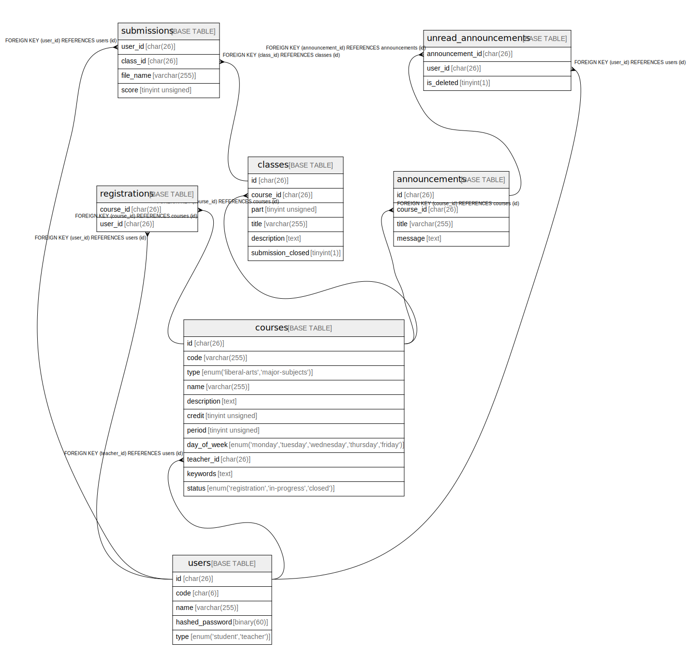

# isucholar

## Tables

| Name | Columns | Comment | Type |
| ---- | ------- | ------- | ---- |
| [announcements](announcements.md) | 4 |  | BASE TABLE |
| [classes](classes.md) | 6 |  | BASE TABLE |
| [courses](courses.md) | 11 |  | BASE TABLE |
| [registrations](registrations.md) | 2 |  | BASE TABLE |
| [submissions](submissions.md) | 4 |  | BASE TABLE |
| [unread_announcements](unread_announcements.md) | 3 |  | BASE TABLE |
| [users](users.md) | 5 |  | BASE TABLE |

## Relations

---

> Generated by [tbls](https://github.com/k1LoW/tbls)
