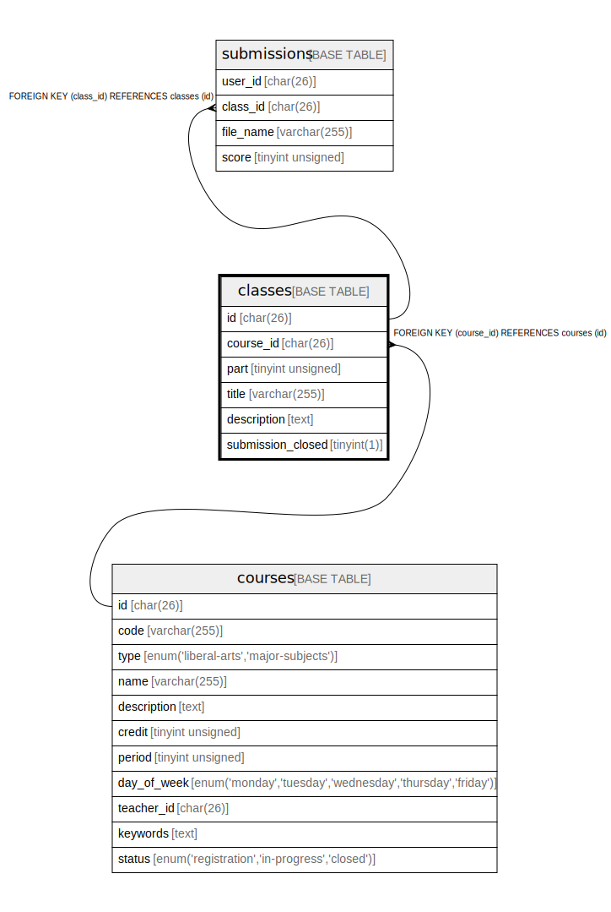

# classes

## Description

<details>
<summary><strong>Table Definition</strong></summary>

```sql
CREATE TABLE `classes` (
  `id` char(26) COLLATE utf8mb4_bin NOT NULL,
  `course_id` char(26) COLLATE utf8mb4_bin NOT NULL,
  `part` tinyint unsigned NOT NULL,
  `title` varchar(255) COLLATE utf8mb4_bin NOT NULL,
  `description` text COLLATE utf8mb4_bin NOT NULL,
  `submission_closed` tinyint(1) NOT NULL DEFAULT '0',
  PRIMARY KEY (`id`),
  UNIQUE KEY `idx_classes_course_id_part` (`course_id`,`part`),
  CONSTRAINT `FK_classes_course_id` FOREIGN KEY (`course_id`) REFERENCES `courses` (`id`)
) ENGINE=InnoDB DEFAULT CHARSET=utf8mb4 COLLATE=utf8mb4_bin
```

</details>

## Columns

| Name | Type | Default | Nullable | Children | Parents | Comment |
| ---- | ---- | ------- | -------- | -------- | ------- | ------- |
| id | char(26) |  | false | [submissions](submissions.md) |  |  |
| course_id | char(26) |  | false |  | [courses](courses.md) |  |
| part | tinyint unsigned |  | false |  |  |  |
| title | varchar(255) |  | false |  |  |  |
| description | text |  | false |  |  |  |
| submission_closed | tinyint(1) | 0 | false |  |  |  |

## Constraints

| Name | Type | Definition |
| ---- | ---- | ---------- |
| FK_classes_course_id | FOREIGN KEY | FOREIGN KEY (course_id) REFERENCES courses (id) |
| idx_classes_course_id_part | UNIQUE | UNIQUE KEY idx_classes_course_id_part (course_id, part) |
| PRIMARY | PRIMARY KEY | PRIMARY KEY (id) |

## Indexes

| Name | Definition |
| ---- | ---------- |
| PRIMARY | PRIMARY KEY (id) USING BTREE |
| idx_classes_course_id_part | UNIQUE KEY idx_classes_course_id_part (course_id, part) USING BTREE |

## Relations



---

> Generated by [tbls](https://github.com/k1LoW/tbls)
