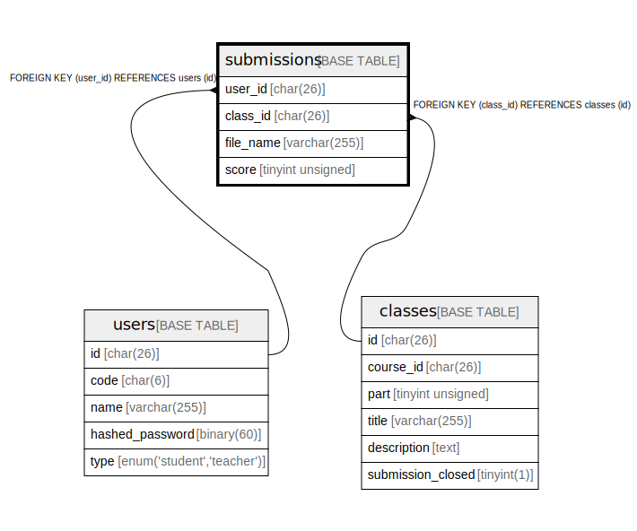

# submissions

## Description

<details>
<summary><strong>Table Definition</strong></summary>

```sql
CREATE TABLE `submissions` (
  `user_id` char(26) COLLATE utf8mb4_bin NOT NULL,
  `class_id` char(26) COLLATE utf8mb4_bin NOT NULL,
  `file_name` varchar(255) COLLATE utf8mb4_bin NOT NULL,
  `score` tinyint unsigned DEFAULT NULL,
  PRIMARY KEY (`user_id`,`class_id`),
  KEY `FK_submissions_class_id` (`class_id`),
  CONSTRAINT `FK_submissions_class_id` FOREIGN KEY (`class_id`) REFERENCES `classes` (`id`),
  CONSTRAINT `FK_submissions_user_id` FOREIGN KEY (`user_id`) REFERENCES `users` (`id`)
) ENGINE=InnoDB DEFAULT CHARSET=utf8mb4 COLLATE=utf8mb4_bin
```

</details>

## Columns

| Name | Type | Default | Nullable | Children | Parents | Comment |
| ---- | ---- | ------- | -------- | -------- | ------- | ------- |
| user_id | char(26) |  | false |  | [users](users.md) |  |
| class_id | char(26) |  | false |  | [classes](classes.md) |  |
| file_name | varchar(255) |  | false |  |  |  |
| score | tinyint unsigned |  | true |  |  |  |

## Constraints

| Name | Type | Definition |
| ---- | ---- | ---------- |
| FK_submissions_class_id | FOREIGN KEY | FOREIGN KEY (class_id) REFERENCES classes (id) |
| FK_submissions_user_id | FOREIGN KEY | FOREIGN KEY (user_id) REFERENCES users (id) |
| PRIMARY | PRIMARY KEY | PRIMARY KEY (user_id, class_id) |

## Indexes

| Name | Definition |
| ---- | ---------- |
| FK_submissions_class_id | KEY FK_submissions_class_id (class_id) USING BTREE |
| PRIMARY | PRIMARY KEY (user_id, class_id) USING BTREE |

## Relations



---

> Generated by [tbls](https://github.com/k1LoW/tbls)
