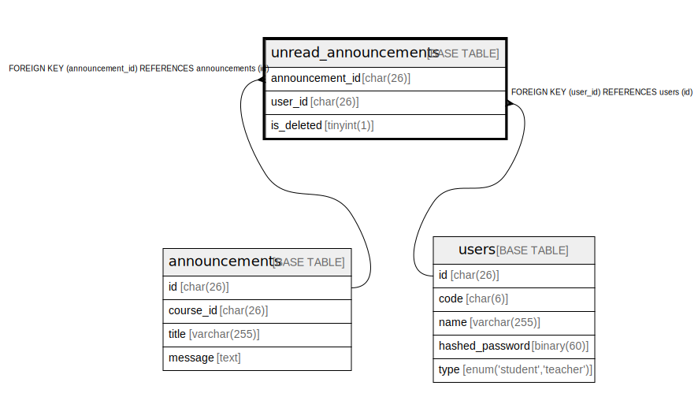

# unread_announcements

## Description

<details>
<summary><strong>Table Definition</strong></summary>

```sql
CREATE TABLE `unread_announcements` (
  `announcement_id` char(26) COLLATE utf8mb4_bin NOT NULL,
  `user_id` char(26) COLLATE utf8mb4_bin NOT NULL,
  `is_deleted` tinyint(1) NOT NULL DEFAULT '0',
  PRIMARY KEY (`announcement_id`,`user_id`),
  KEY `FK_unread_announcements_user_id` (`user_id`),
  CONSTRAINT `FK_unread_announcements_announcement_id` FOREIGN KEY (`announcement_id`) REFERENCES `announcements` (`id`),
  CONSTRAINT `FK_unread_announcements_user_id` FOREIGN KEY (`user_id`) REFERENCES `users` (`id`)
) ENGINE=InnoDB DEFAULT CHARSET=utf8mb4 COLLATE=utf8mb4_bin
```

</details>

## Columns

| Name | Type | Default | Nullable | Children | Parents | Comment |
| ---- | ---- | ------- | -------- | -------- | ------- | ------- |
| announcement_id | char(26) |  | false |  | [announcements](announcements.md) |  |
| user_id | char(26) |  | false |  | [users](users.md) |  |
| is_deleted | tinyint(1) | 0 | false |  |  |  |

## Constraints

| Name | Type | Definition |
| ---- | ---- | ---------- |
| FK_unread_announcements_announcement_id | FOREIGN KEY | FOREIGN KEY (announcement_id) REFERENCES announcements (id) |
| FK_unread_announcements_user_id | FOREIGN KEY | FOREIGN KEY (user_id) REFERENCES users (id) |
| PRIMARY | PRIMARY KEY | PRIMARY KEY (announcement_id, user_id) |

## Indexes

| Name | Definition |
| ---- | ---------- |
| FK_unread_announcements_user_id | KEY FK_unread_announcements_user_id (user_id) USING BTREE |
| PRIMARY | PRIMARY KEY (announcement_id, user_id) USING BTREE |

## Relations



---

> Generated by [tbls](https://github.com/k1LoW/tbls)
