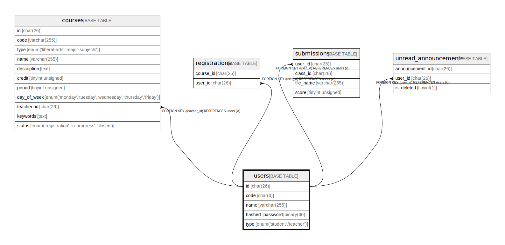

# users

## Description

<details>
<summary><strong>Table Definition</strong></summary>

```sql
CREATE TABLE `users` (
  `id` char(26) COLLATE utf8mb4_bin NOT NULL,
  `code` char(6) COLLATE utf8mb4_bin NOT NULL,
  `name` varchar(255) COLLATE utf8mb4_bin NOT NULL,
  `hashed_password` binary(60) NOT NULL,
  `type` enum('student','teacher') COLLATE utf8mb4_bin NOT NULL,
  PRIMARY KEY (`id`),
  UNIQUE KEY `code` (`code`)
) ENGINE=InnoDB DEFAULT CHARSET=utf8mb4 COLLATE=utf8mb4_bin
```

</details>

## Columns

| Name | Type | Default | Nullable | Children | Parents | Comment |
| ---- | ---- | ------- | -------- | -------- | ------- | ------- |
| id | char(26) |  | false | [courses](courses.md) [registrations](registrations.md) [submissions](submissions.md) [unread_announcements](unread_announcements.md) |  |  |
| code | char(6) |  | false |  |  |  |
| name | varchar(255) |  | false |  |  |  |
| hashed_password | binary(60) |  | false |  |  |  |
| type | enum('student','teacher') |  | false |  |  |  |

## Constraints

| Name | Type | Definition |
| ---- | ---- | ---------- |
| code | UNIQUE | UNIQUE KEY code (code) |
| PRIMARY | PRIMARY KEY | PRIMARY KEY (id) |

## Indexes

| Name | Definition |
| ---- | ---------- |
| PRIMARY | PRIMARY KEY (id) USING BTREE |
| code | UNIQUE KEY code (code) USING BTREE |

## Relations



---

> Generated by [tbls](https://github.com/k1LoW/tbls)
